# Phoenix v9 -- Production Architecture

## 0. Purpose

This document defines the Phoenix control-flow, state-model, ownership, and
reconciliation rules that production should satisfy. It is not, by itself, proof
of what is deployed.

For current operations, the OCI VM is the source of truth. If this document,
historical docs, compose comments, or old runbooks conflict with the running VM,
the VM wins and the document must be corrected.

Current VM evidence is captured in [docs/OCI_VM_RUNTIME.md](docs/OCI_VM_RUNTIME.md).
The runtime glossary and operator-facing endpoint behavior index is
[docs/ENCYCLOPEDIA.md](docs/ENCYCLOPEDIA.md).

### 0.1 Verified OCI VM Runtime

Verified on 2026-06-06 from the running OCI VM:

- Repo checkout: `/opt/phoenix/app`
- Active branch/commit: `main` at `4ba598f...`; deploy env image tag
  `local-4ba598f`
- Compose project: `phoenix-oci-live`
- Compose files: `/opt/phoenix/app/docker-compose.oci-live.yml` plus `/opt/phoenix/phoenix-override.yml`
- Env file: `/opt/phoenix/phoenix-deploy.env`
- Backend: `phoenix-oci-backend`, image `phoenix-local-backend:local-4ba598f`, command `python -m app.main`
- Web: `phoenix-oci-web`, image `phoenix-local-nginx:local-4ba598f`
- Database: VM-local `phoenix-oci-postgres`, image `postgres:16-alpine`, Compose-managed with Docker health status `healthy`
- Watchdog: `phoenix-oci-watchdog`, image `docker:cli`, observe-only with no Docker socket or mounts
- OI/ML shadow sidecar: `phoenix-oi-ml-shadow`, image `phoenix-oi-ml-shadow:oi-ml-shadow-bd999cd`, dry-run only, no host ports
- Runtime health: backend `/health`, `/ready`, `/readyz`, and `/health/summary` return 200 from inside the backend container
- Health evidence: `/health` reports `order_path=strategy_bridge_order_router`; `/health/summary` reports `operating_mode=HUB_AUTHORITATIVE`; backend-local `/readyz` returns 200; public nginx `/readyz` and `/health/summary` are redacted; public nginx `/health/alerts` and `/health/mitigations` proxy JSON to support the operator screens
- Frontend health rendering: the Overview and Safety dashboards use
  authenticated `/admin/health/summary` for internal-only schema, watchdog, and
  account-count fields; they fall back to redacted public `/health/summary`
  without crashing when authentication is unavailable

The current VM differs from the intended OCIR/external-Postgres shape in these
important ways:

- Local images are used instead of OCIR images.
- A VM-local Postgres container is used instead of an external OCI PostgreSQL endpoint.
- The backend has source-file bind mounts from `/opt/phoenix/app`.
- `CONTROL_PLANE_PG_SSLMODE=prefer` and `LIVE_PG_SSL_SKIP_CHECK=true` are present for the local DB path.
- The nginx container mounts `/opt/phoenix/nginx-ssl-prerendered.conf.template`, not the repo nginx template directly. Keep this host template in sync with repo route changes before recreating nginx.
- Phoenix still shares the VM with unrelated public workloads until the
  isolation backlog is resolved or risk-accepted.

These facts are operational state, not recommendations. Any future move to OCIR
images or external Postgres requires a fresh VM evidence capture and doc update.

The OI/ML CE seller sidecar is not part of the live order authority path. It is
currently a shadow-only process that writes `option_chain_1m` and
`oi_ml_shadow_order_intents` records for validation. Its progress and promotion
gates are tracked in
[docs/runbooks/oi_ml_shadow_sidecar.md](docs/runbooks/oi_ml_shadow_sidecar.md).

### 0.2 Production Contract

The production safety contract remains:

- One authoritative live state path per scope.
- Broker order placement and authoritative lifecycle mutation must pass through
  the hub bridge/router path when the backend reports hub-authoritative mode.
- Durable Postgres state is required for outbox, lifecycle, ownership,
  kill-switch, tenant/account/subscription, strategy config, and trade/audit
  records.
- Backend-local `/readyz` and `/health/summary` are the detailed readiness
  evidence surfaces. Public nginx readiness/summary responses are redacted, and
  dashboard code must treat omitted internal diagnostics as unavailable instead
  of crashing.
- Direct BFF access to internal diagnostics such as `/bff/health/summary`,
  `/bff/readyz`, and `/bff/dashboard/status` is blocked; use authenticated
  admin routes for operator-only details.
- Secret values must come from runtime secret files or approved stores, never
  committed env files.
- `DISABLE_STREAM_WORKER=true` is not an automated-LIVE profile unless an
  approved replacement market-data, bar, indicator, and strategy plane is
  verified on the VM.

Docker Desktop, Cloud Run, Firestore, BigQuery, and GCP references are
non-current unless future OCI VM evidence proves they are active.

---

## 1. Operating Modes & Ownership Boundaries

Phoenix runs in one of two mutually exclusive operating modes. Only one mode may be authoritative for live order and position control at a time.

### Mode A -- Legacy Single-Tenant Authoritative
- `RiskManager` is authoritative for internal live position state.
- `risk_positions.json` is a local restart helper only.
- Broker positions and orders are observed state, never a direct source of truth.
- Hub services must be disabled or read-only.
- Permitted only for explicitly scoped single-tenant deployments; must not coexist with hub-authoritative writes for the same contract/account.

### Mode B -- Hub Multi-Tenant Authoritative
- `StateStore`, `PositionOwnershipStore`, `OrderSubmissionOutbox`, and `OrderLifecycleService` are authoritative for order and position lifecycle.
- Legacy `RiskManager` must not independently create, delete, or release hub-owned positions.
- Hub lifecycle services and exit engines are authoritative for automated exits.
- Broker positions and orders are observed state, entering through reconciliation rules.
- In the hub-authoritative automated profile, legacy stream code remains enabled for market data, bar construction, indicator updates, and strategy signals. It must submit through the hub path and must not bypass hub ownership, risk policy, or lifecycle policy.

### Non-negotiable authority rules
1. A contract may have **one authoritative owner path at a time**: legacy or hub.
2. Mixed write ownership is forbidden.
3. In the current automated LIVE profile, the stream worker may consume market data and generate strategy signals, but only the hub/router/lifecycle path may be authoritative for order submission and live state transitions.
4. In hub-authoritative LIVE mode, legacy stream-side automated exits are read-only except for an audited break-glass emergency path.
5. Break-glass exits require elevated authorization, emit audit events with reason codes, and reconcile back into authoritative lifecycle state before ownership release.
6. Any ambiguity about the active authority path is a startup failure, not a runtime warning.

---

## 2. Source-of-Truth Matrix

| Entity | Authoritative Store | Secondary / Derived Stores | Notes |
|---|---|---|---|
| Runtime feature flags | runtime config + versioned feature flag loader | admin read views | Unsafe defaults may not be inherited in LIVE; overrides must be audited and versioned |
| Order submission intent | `order_submission_outbox` (Postgres required in LIVE) | local queues for transient processing only | In-memory fallback is forbidden for authoritative LIVE routing |
| Order lifecycle state | persisted `OrderLifecycleService` state | broker snapshot cache, dashboard | Broker API is external observed state, not directly canonical |
| Internal live position state | `StateStore` in hub mode or `RiskManager` in legacy mode | dashboard, analytics, JSON restart helpers | Only one owner path may mutate live state |
| Contract ownership lock | `position_ownership` (Postgres required in LIVE) | in-memory fallback only for non-LIVE/dev | Ownership is separate from position quantity |
| Broker-observed positions | broker poll snapshot | reconciliation tables, dashboard | Used for reconciliation and inventory refresh; not sufficient by itself for fresh mark-to-market |
| Broker-observed orders | broker poll snapshot | lifecycle transition evidence | Used as evidence for terminality, partial fills, rejects |
| Live ticks / mark prices | stream-worker market-data cache in the current automated LIVE baseline | dashboard, bar engine, indicators, pnl views | An approved replacement market-data plane is required before disabling stream worker for automated LIVE |
| PnL control state | `PnLEngine` / persisted pnl snapshots with freshness metadata | dashboard, BigQuery | Fresh open PnL requires a live mark source; broker inventory sync alone is not sufficient for non-stale mark-to-market |
| Kill switch state | authoritative runtime risk state + persisted snapshot | dashboard | JSON file is a restart helper only, never control authority in LIVE hub mode |
| Indicator bars | Postgres preferred | CSV, SQLite, BigQuery | CSV/SQLite are convenience stores; Postgres is the preferred warmup source |
| Trades / audit facts | Postgres or structured trade ledger | CSV, BigQuery, dashboard | CSV/BQ are analytics and reporting, not control authority |
| Sweep / EOD state | Postgres preferred and required for LIVE automation | dashboard, BigQuery | Must be idempotent, replay-safe, and durable across restarts |
| Dashboard payloads | none | `DashboardBus` | Dashboard is always derived, never authoritative |
| Control-plane credentials and secrets | Approved platform secret store in LIVE; Postgres is allowed for broker credentials | short-lived injected env/file mounts only | Repo files and long-lived plaintext env are forbidden for LIVE |
| Hub routing table | Postgres (`CONTROL_PLANE_BACKEND=postgres`) | in-memory cache refreshed from Postgres | Firestore was a prior implementation; current LIVE stack uses Postgres exclusively. If `CONTROL_PLANE_BACKEND=firestore`, Google ADC credentials (`GOOGLE_APPLICATION_CREDENTIALS`) are required — see compose comment |

Clarification: "current LIVE stack" in the matrix means the OCI VM runtime
verified in section 0.1. Firestore-capable code remains compatibility/reference
only unless this contract is revised after a fresh VM audit.

### Firestore dependency status

Firestore is **not active** in the current OCI VM runtime. All authoritative
backends use Postgres:
- Control plane / routing table: `CONTROL_PLANE_BACKEND=postgres`
- Sweep / EOD state: `SWEEP_STATE_BACKEND=postgres`
- Leader lease: `LEADER_LEASE_BACKEND=postgres`
- Broker secrets: `BROKER_SECRET_BACKEND=postgres`
- Runtime config: `RUNTIME_CONFIG_ENABLED=false`

If any backend is ever switched to Firestore:
1. Mount a GCP service-account JSON key into the container
2. Set `GOOGLE_APPLICATION_CREDENTIALS=/path/to/sa.json`
3. Verify ADC access with `gcloud auth application-default print-access-token`
4. Monitor Firestore quota via GCP Console → Firestore → Usage
5. Fallback on Firestore outage: switch `CONTROL_PLANE_BACKEND=postgres` and redeploy

### PnL state store backends

The PnL state store (`app/pnl/state_store.py`) supports four backends selected by the `PNL_STATE_BACKEND` environment variable:

| Backend | Env value | LIVE status |
|---|---|---|
| `PostgresPnLStateStore` | `postgres` | **Required for authoritative LIVE use** |
| `FirestorePnLStateStore` | `firestore` | Available but not active in current LIVE stack; requires GCP ADC credentials |
| `RedisPnLStateStore` | `redis` or `cache` | Available for low-latency caching; requires `PNL_STATE_REDIS_URL`; not authoritative in LIVE |
| `InMemoryPnLStateStore` | anything else / unset | Dev/test only; forbidden in LIVE for authoritative use |

Only `PostgresPnLStateStore` satisfies the LIVE durable-store requirement (§2 storage policy). Redis may be used as a read-through cache layer but must not be the sole authoritative PnL store in LIVE. Firestore is treated identically to the routing-table Firestore rules above.

### Storage policy
- **Authoritative stores** decide live behavior.
- **Observed stores** provide reconciliation evidence.
- **Derived stores** support UI and analytics only.
- **Restart helpers** may seed recovery but cannot override authoritative live state without reconciliation.
- In LIVE, loss of an authoritative store is a fail-stop condition for startup and for any new order flow that depends on it.
- In LIVE, in-memory or local-file fallbacks are prohibited for outbox, lifecycle, ownership, kill-switch durability, and processed markers.
- Postgres is the current authoritative operational store. Any future BigQuery replacement must preserve equivalent idempotency, mutation serialization, and fail-closed startup guarantees before becoming authoritative.

---

## 3. Core State Model

Phoenix explicitly separates five concepts:

### 3.1 Order Intent
The internal request to place, modify, cancel, or exit an order.

### 3.2 Order Lifecycle State
The authoritative internal view of the order state.

Allowed states:
- `CREATED`
- `VALIDATED`
- `SUBMITTING`
- `SUBMITTED`
- `ACKED`
- `OPEN`
- `PARTIAL_FILL`
- `FILLED`
- `REJECTED`
- `CANCEL_REQUESTED`
- `CANCELLED`
- `EXPIRED`
- `FAILED`
- `TIMEOUT`
- `UNKNOWN`
- `RECONCILING`
- `RECOVERY_PENDING`

`RECOVERY_PENDING` is set during startup reconciliation for orders restored from durable state before broker evidence is evaluated. Orders in this state may transition to any active or terminal state once reconciliation completes. They do not accept new lifecycle mutations until reconciliation resolves them.

Terminal states:
- `FILLED`
- `REJECTED`
- `CANCELLED`
- `EXPIRED`
- `FAILED`

### 3.3 Internal Position State
The system's authoritative view of live quantity, average price, realized/unrealized PnL attribution, and strategy/account association.

Allowed internal position states:
- `NONE`
- `ENTRY_PENDING`
- `OPENING`
- `OPEN`
- `PARTIALLY_EXITED`
- `EXIT_PENDING`
- `FLAT_PENDING_CONFIRMATION`
- `FLAT`
- `ADOPTED`
- `FORCED_FLATTENING`
- `RECONCILING`
- `DEGRADED`
- `MANUAL_REVIEW`
- `RECOVERY_PENDING`

`RECOVERY_PENDING` is set during startup when persisted positions are restored from durable state before broker reconciliation completes. Positions in this state are not considered live and block new entries until reconciliation resolves them to an active state (`OPEN`, `ADOPTED`), a terminal state (`FLAT`), or an ambiguous state (`RECONCILING`, `DEGRADED`, `NONE`).

Required fields:
- `position_id`
- `tenant_id`
- `account_id`
- `strategy_id`
- `ownership_key`
- `contract_key`
- `side`
- `net_qty`
- `filled_qty_open`
- `filled_qty_close`
- `avg_open_price`
- `avg_close_price`
- `realized_pnl`
- `unrealized_pnl`
- `position_state`
- `state_reason`
- `opened_by_order_id`
- `last_evidence_at`
- `last_reconciled_at`

Transition rules:
- New entries move `NONE -> ENTRY_PENDING -> OPENING -> OPEN` once fill evidence is durable.
- Partial exits move `OPEN -> PARTIALLY_EXITED`; remaining quantity stays live until confirmed flat.
- Full exits move `OPEN|PARTIALLY_EXITED -> EXIT_PENDING -> FLAT_PENDING_CONFIRMATION -> FLAT`.
- Broker-adopted positions move `NONE -> ADOPTED` only through explicit reconciliation or operator-approved adoption.
- Ambiguous quantity, price, or ownership evidence moves the position to `RECONCILING`, not to silent `FLAT`.
- Failed remap, broken exit management, or unresolved contract metadata moves the position to `DEGRADED`.
- Operator intervention may move the position to `MANUAL_REVIEW` until convergence is complete.
- `FORCED_FLATTENING` is reserved for authoritative position-state writers that explicitly persist a forced-flatten lifecycle; the current break-glass admin route does not fabricate this state on its own.

Implementation rule:
`FLAT` is reached only after authoritative internal quantity, broker evidence, and lifecycle evidence agree per reconciliation policy. A single missing snapshot is never sufficient to force `FLAT`.

### 3.4 Contract Ownership State
The strategy/account right to control entries/exits for a contract key.

Allowed ownership states:
- `NONE`
- `PENDING_LOCK`
- `OWNED`
- `RELEASING`
- `RECONCILING`
- `ORPHAN_REVIEW`

Implementation note:
- Ownership does not introduce a separate `FORCED_FLATTENING` state.
- Break-glass flattening is represented as `RELEASING` with `break_glass_override_id` plus an explicit break-glass `state_reason`.
- The current break-glass admin route uses this `RELEASING` path plus audit/order lifecycle evidence; it does not synthesize a standalone ownership state.

### 3.5 Broker-Observed State
External snapshots returned by broker APIs for positions and orders. These are evidence inputs into reconciliation and must not directly mutate authoritative state on a single poll.

---

## 4. Contract Identity and Ownership Scope Standard

All stateful components must use a stable `ContractKey`, and all authoritative mutation decisions must use a stable `OwnershipKey`.

### 4.1 ContractKey

Recommended shape:
- underlying
- expiry
- strike
- option_type
- product_type
- exchange
- broker_symbol
- broker_token
- instrument_version

### 4.2 OwnershipKey

Exact LIVE ownership scope:
- `tenant_id`
- `account_id`
- `broker_account_id` or equivalent canonical runner/account scope
- `product_type`
- normalized `contract_key`

Normalized form:
`OwnershipKey = tenant_id + account_id + broker_account_id + product_type + normalized_contract_key`

### 4.3 Owner metadata
Stored against the `OwnershipKey`, but not part of the key:
- `strategy_id`
- `authority_path` (`legacy` or `hub`)
- `position_id`
- `opened_by_order_id`
- `owner_state`
- `owner_acquired_at`
- `last_evidence_at`
- `break_glass_override_id` if applicable

### Scope rules
- Ownership is **per nettable contract per tenant/account/product scope**.
- `strategy_id` is the owner value, not part of the lock key. This prevents two strategies from independently locking the same live nettable contract in the same account.
- Different accounts do not conflict with each other.
- Different tenants do not conflict unless they intentionally share the same broker account scope; such shared-account live write ownership is forbidden unless a single authoritative controller owns that scope.
- Display labels, ATM aliases, and UI symbols are never valid ownership keys.
- Exit authority follows the `OwnershipKey`; routine exits must come from the current recorded owner or from an audited elevated break-glass path.

### Rules
- Ownership uses `OwnershipKey`, not display label.
- ATM refresh must preserve remap history from old token/label to new token/label while retaining the same `OwnershipKey` semantics where the live economic contract has not changed.
- Strategy state must reference contract identity, not only UI labels.
- Any component unable to derive the normalized `OwnershipKey` must fail closed for fresh entries.

---

## 5. System Boot & Initialization

```mermaid
flowchart TD
    START([python -m app.main]) --> LOAD_ENV[Load env + runtime config]
    LOAD_ENV --> RESOLVE_SECRETS[Resolve secrets from approved platform store or Postgres]
    RESOLVE_SECRETS --> CONFIG_LOG[Configure logging + audit logging]
    CONFIG_LOG --> PORT_CHECK{Port available?}
    PORT_CHECK -- No --> EXIT_FAIL([sys.exit 1])
    PORT_CHECK -- Yes --> UVICORN[uvicorn.run app.server:app]

    UVICORN --> LIFESPAN[FastAPI lifespan]
    LIFESPAN --> GET_RUNTIME[get_app_runtime]
    GET_RUNTIME --> RUNTIME_START[await runtime.start]

    subgraph AppRuntime.start
        RUNTIME_START --> BOOT_CFG[Load strategy_env.yaml, universe.yaml, settings]
        BOOT_CFG --> FEATURE_FLAGS[Load stability / rollout flags]
        FEATURE_FLAGS --> SCHEMA_CHECK[Verify DB tables, indexes, migrations]
        SCHEMA_CHECK --> VALIDATE{LIVE mode?}
        VALIDATE -- Yes --> STRICT_VALIDATE[Strict startup validation]
        VALIDATE -- No --> LEADER_CHECK
        STRICT_VALIDATE --> VALIDATE_LIVE[Validate LIVE invariants + durable backends]
        VALIDATE_LIVE --> LEADER_CHECK

        LEADER_CHECK{Leader lease enabled?}
        LEADER_CHECK -- Yes --> ACQUIRE_LEASE[Acquire fencing lease]
        LEADER_CHECK -- No --> IS_LEADER[is_leader = true]
        ACQUIRE_LEASE --> LEASE_RESULT{Lease acquired?}
        LEASE_RESULT -- Yes --> IS_LEADER
        LEASE_RESULT -- No --> NOT_LEADER[Standby mode only]

        IS_LEADER --> WORKER_CHECK{disable_stream_worker?}
        WORKER_CHECK -- Yes --> BQ_START
        WORKER_CHECK -- No --> START_WORKER[Start StreamWorker]
        START_WORKER --> START_WATCHDOG[Start WorkerWatchdog]
        START_WATCHDOG --> BQ_START

        BQ_START[Start BigQuery async writer if enabled] --> HUB_CHECK{enable_multi_hub?}
        HUB_CHECK -- No --> RUNTIME_READY([Runtime Ready])
        HUB_CHECK -- Yes --> HUB_INIT
    end

    subgraph HubRuntime Init
        HUB_INIT[Create hub runtime] --> CREATE_ENGINES[CapitalEngine + PnLEngine + RiskEngine + ProfitEngine pre-trade + SweepProfitEngine exit]
        CREATE_ENGINES --> CREATE_STATE[Create StateStore + PositionOwnershipStore + Outbox]
        CREATE_STATE --> CREATE_HUB[Create Hub + RoutingTable]
        CREATE_HUB --> CREATE_LIFECYCLE[Create OrderLifecycleService]
        CREATE_LIFECYCLE --> CREATE_ROUTER[Create OrderRouter + circuit breaker]
        CREATE_ROUTER --> CREATE_EXIT_ENGINES[Create ProfitSweepEngine + EODExitEngine]
        CREATE_EXIT_ENGINES --> HUB_INITIALIZE[Load tenants + broker accounts]
        HUB_INITIALIZE --> HUB_START_ALL[Start AccountRunners]
        HUB_START_ALL --> RESTORE_STATE[Restore persisted authoritative state into recovery graph]
        RESTORE_STATE --> MARK_PENDING_RECOVERY[Mark recovered objects RECOVERY_PENDING]
        MARK_PENDING_RECOVERY --> BROKER_RECON_START[Initial broker order/position reconciliation against restored state]
        BROKER_RECON_START --> RECOVERY_GUARD[Validate recoverable outbox, ownership, markers, and unresolved scopes]
        RECOVERY_GUARD --> LIFECYCLE_START[Start lifecycle polling in recovery mode]
        LIFECYCLE_START --> OUTBOX_RECOVER[Recover and evaluate pending outbox items]
        OUTBOX_RECOVER --> REPLAY_DECISION{Replay still required?}
        REPLAY_DECISION -- Yes --> REPLAY_PENDING[Replay only safe PENDING orders]
        REPLAY_DECISION -- No --> MARK_RESOLVED[Mark as reconciled/resolved]
        REPLAY_PENDING --> RUNTIME_READY
        MARK_RESOLVED --> RUNTIME_READY
    end
```

### Startup guarantees
- Secret resolution and LIVE invariant validation complete before any live worker or router accepts orders.
- In the hub-authoritative automated profile, the stream worker remains enabled so ticks, bars, indicators, and live marks stay fresh for strategy, dashboard, and PnL logic.
- Broker position/order/balance sync through hub account runners continues independently, but broker sync alone does not satisfy the automated LIVE baseline.
- Persisted authoritative state is restored **before** broker reconciliation, so reconciliation evaluates a populated recovery graph, not an empty runtime.
- Restored objects enter a recovery-pending state and are not considered live until reconciliation converges.
- Broker reconciliation completes **before** replay of pending submissions.
- Pending orders are replayed only if reconciliation does not already prove them terminal, broker-accepted, or blocked for manual review.
- Lease ownership is a fencing token, not just a liveness heartbeat.
- Missing durable backends, insecure auth mode, or ambiguous operating mode are startup failures in LIVE.

### 5.1 LIVE startup gate

LIVE startup must hard-fail unless each control resolves to a safe, explicit state:

| Control | LIVE requirement | Startup behavior if unmet |
|---|---|---|
| Market-data / strategy plane | For automated LIVE today, `DISABLE_STREAM_WORKER=false` or an approved replacement live market-data/bar/indicator/strategy plane exists | Fail startup |
| Router idempotency | Claim-before-submit idempotency enabled and backed by durable storage | Fail startup |
| Position ownership | Ownership guard enabled with durable ledger | Fail startup |
| Order lifecycle durability | Durable outbox, lifecycle state, and processed markers reachable and writable | Fail startup |
| Daily loss guard | Enabled with non-null threshold per account/strategy policy | Fail startup |
| Profit controls | Explicit daily target / profit-lock policy configured per live strategy-account pair | Fail startup |
| EOD policy | Intraday strategies require EOD exit and open-order cancel policy, or a documented approved exemption | Fail startup |
| Kill switch durability | Persisted kill-switch backend available | Fail startup |
| Control-plane auth | Dashboard auth enabled; admin auth backed by an approved platform secret store | Fail startup |
| Demo/local auth | Demo auth and dev-only shortcuts disabled | Fail startup |
| Secret backend | Broker credentials loaded from Postgres or approved secret manager; platform/admin/DB/HMAC/runtime secrets injected from an approved platform secret store | Fail startup |
| In-memory authority | In-memory authoritative fallbacks disabled | Fail startup |
| Authority path | Exactly one authoritative mode resolved for each live contract/account scope | Fail startup |

### 5.2 Current recommended automated LIVE split

For true automated LIVE trading in the current repo, Phoenix should run with:
- `TRADE_MODE=LIVE`
- `ENABLE_MULTI_HUB=true`
- `USE_HUB_ROUTER=true`
- `DISABLE_STREAM_WORKER=false`

Responsibilities in that mode:
- **Stream worker**: broker websocket session, token map, live ticks, last-price cache, bars, indicators, and strategy evaluation/signal generation
- **Hub / router / lifecycle / account runners**: broker balance sync, broker position sync, broker order sync, order submission authority, idempotency, ownership, lifecycle polling, reconciliation, realized PnL booking, and durable control state

Rules:
- Stream worker must not place broker orders directly when hub-authoritative mode is active.
- All automated entries and exits must traverse the strategy bridge and hub router.
- `DISABLE_STREAM_WORKER=true` means operator/control-plane or reconciliation-first mode unless an approved replacement market-data plane exists.

### 5.3 LIVE deployment hardening guards

The following runtime guards were added to the bundled Compose manifest and startup validator as part of production hardening. They are enforced at startup and surface early in backend logs.

| Guard | Env var / mechanism | Behavior |
|---|---|---|
| Stack-lock | `REQUIRE_LIVE_TRADE_MODE=true` in compose | Startup validator hard-fails if the container resolves `TRADE_MODE != LIVE`; prevents accidental SHADOW/PAPER deployment of the LIVE manifest |
| Broker schema check | `BROKER_SCHEMA_CHECK_MODE=strict` in compose | Angel One API responses are validated against expected field shapes at every balance sync cycle; malformed responses are rejected at the integration boundary (see §5.3.1) |
| Risk state isolation | `RISK_STATE_PATH=/app/state/risk_positions.json`; `/app/state` mounted as a separate volume | Risk restart-helper state is stored outside the log volume so it survives log rotation; legacy path (`app/config/risk_positions.json`) is auto-migrated on first start |
| Selector staleness | IST-date comparison in `StrategySelector.select()` | Prior-day selection state is evicted at the first `on_bar` call after IST midnight; prevents stale regime/strategy state from carrying over between trading days |
| Sync freshness gate | `/readyz` returns 503 when position or orders sync age exceeds `2 × POSITION_SYNC_INTERVAL_SECONDS` / `2 × ORDERS_SYNC_INTERVAL_SECONDS` | Downstream health checks and container restart policy can detect a broker-sync stall before it produces stale exposure decisions |
| Unroutable strategy exclusion | `routed_strategy_ids()` cross-reference at stream startup | Strategies enabled in the strategy switch but absent from the routing table are logged as `strategy.unroutable` warnings and excluded from selector evaluation in LIVE+`AUTO_STRATEGY_SELECT_ENABLED`; their signals are silently dropped by the router |
| SSL mode warning | Startup emits `startup.ssl_warning` when `CONTROL_PLANE_PG_SSLMODE=disable` in LIVE | Operators are alerted when the Postgres connection is unencrypted; for host-local Docker deployments where Postgres does not have SSL enabled, this warning is expected and does not block startup |
| Reconnect telemetry | `stream_worker.reconnect_complete` / `stream_worker.reconnect_failed` log events in `ws_runner` | Reconnect attempts and final reconnect failures are emitted as structured log events so stream-plane reliability can be monitored from the log stream without custom instrumentation |

#### 5.3.1 Angel One broker balance schema

Angel One's RMS API returns component-level utilized-margin fields (`utilisedspan`, `utilisedoptionpremium`, `utilisedexposure`, `utiliseddebits`, `utilisedturnover`, `utilisedpayout`) rather than a single rolled-up `utilisedmargin` field. In strict mode (`BROKER_SCHEMA_CHECK_MODE=strict`), the balance parser:
1. First tries primary rolled-up keys (`utilisedmargin`, `utilized`, `utilised`, `used`).
2. If none are present, sums the component fields as the utilized margin.
3. Logs a DEBUG if the component-sum path is used; does not log CRITICAL.

This behavior is correct for Angel One's current API and must not be changed to a hard failure unless Angel One adds a rolled-up field.

#### 5.3.2 Expected startup log warnings

The following WARNING-level messages appear on every startup and are expected behavior, not incidents:

| Message | Source | Why expected |
|---|---|---|
| `LIVE mode policy gates enforced hardened defaults for: {...}` | `app_runtime` | Confirms LIVE-mode flags were auto-promoted; no action needed |
| `startup.ssl_warning: TRADE_MODE=LIVE but CONTROL_PLANE_PG_SSLMODE=disable` | `app_runtime` | Expected for host-local Docker deployments; set `CONTROL_PLANE_PG_SSLMODE=require` once Postgres SSL is enabled |
| `illegal transition blocked ... from_state=RECONCILING attempted_target=EXIT_PENDING/OPENING; escalating to DEGRADED` | `order_lifecycle` | Stale position records from expired option contracts (prior-session data) are safely escalated to DEGRADED during startup reconciliation; not indicative of a live position problem |
| `strategy.unroutable name=<strategy>` × N | `multi_instrument_stream` | Strategies enabled in the strategy switch but not in the routing table; correct behavior per §5.3 |
| `strategy.unroutable_selector_excluded count=N` | `multi_instrument_stream` | Summary of unroutable strategies excluded from the selector; expected in LIVE+AUTO mode |

---

## 6. Stream Worker Initialization (Current Market-Data & Strategy Path)

In the hub-authoritative automated profile, this worker remains enabled. It is responsible for market data, bar construction, indicator updates, and strategy signals. It is not the authoritative execution or lifecycle plane.

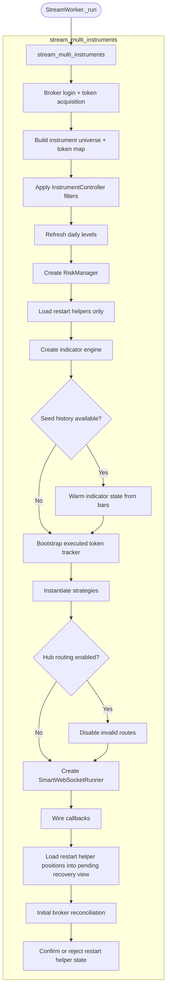

### Stream-side startup rule
`risk_positions.json` may suggest candidate positions for recovery, but broker reconciliation and internal evidence decide whether they become live authoritative positions.

---

## 7. Market Data Flow (Tick Processing)

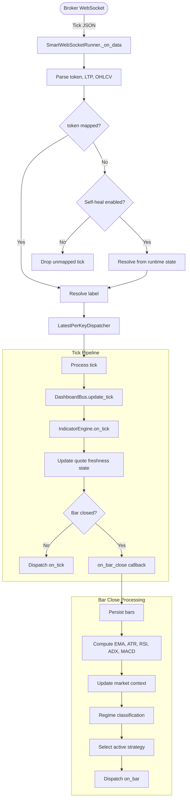

### Freshness rule
Risk checks using unrealized PnL or mark-to-market values must validate quote freshness. If marks are stale beyond threshold, the system must:
- block fresh discretionary entries, or
- downgrade to safer sizing / no-trade mode,
- while still allowing approved risk-reducing exits.

---

## 8. Strategy Signal Generation

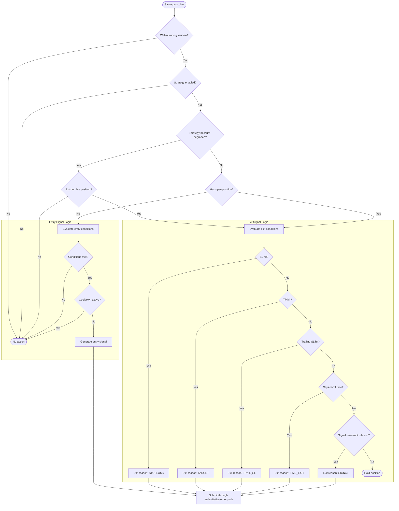

### Required exit fields
Every exit order must carry:
- `exit_reason`
- `strategy_id`
- `account_id`
- `contract_key`
- `position_id` or equivalent internal reference

---

## 9. Order Lifecycle (Legacy Path)

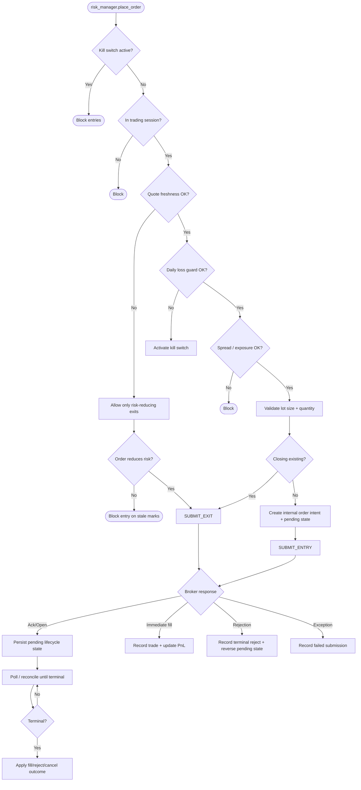

### Legacy improvement rules
- When hub-authoritative mode is active, stream-side strategies must submit through the authoritative hub order path; direct broker placement is forbidden.
- The legacy path must not discard terminal order states simply because the latest broker poll filters them out. Terminal evidence must be retained until lifecycle consumers have applied it.
- In hub-authoritative LIVE mode, legacy `RiskManager` may not trigger automated exits or ownership release outside the hub route. It may only emit a break-glass request through the authoritative exit path.

---

## 10. Order Lifecycle (Hub Path)

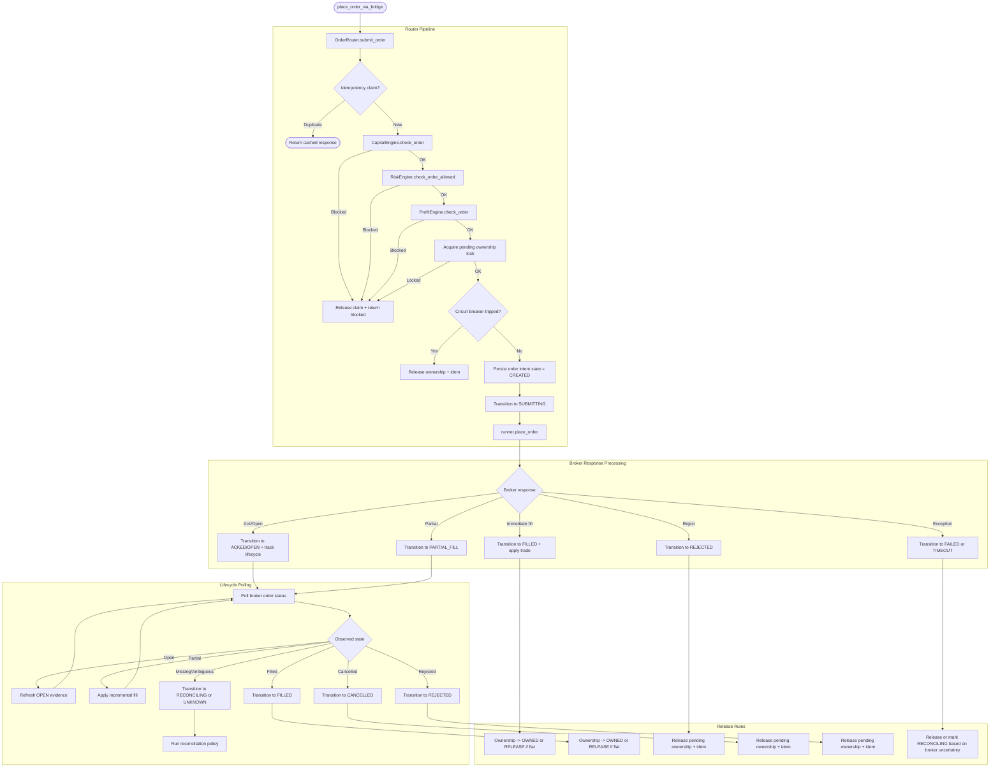

### Hub lifecycle rules
- Ownership release occurs only after confirmed flat state or terminal non-fill outcome.
- Partial fills must update internal position quantity and remaining open quantity separately.
- Unknown or ambiguous status must move to `RECONCILING`, not to silent release.
- Capital, margin, PnL, and freshness checks must fail closed when required inputs are unavailable or stale beyond policy.
- Durable idempotency, lifecycle, and processed-trade markers must be written before terminal release decisions are finalized in LIVE.
- Terminal state evidence must be preserved for downstream consumers and audits.

---

## 11. Reconciliation Rules

### 11.1 Startup reconciliation order
At startup, the system must reconcile in this exact sequence:
1. Load persisted outbox entries
2. Load persisted ownership locks
3. Load persisted internal live positions
4. Mark restored records as `RECOVERY_PENDING`
5. Fetch broker-observed orders
6. Fetch broker-observed positions
7. Reconcile restored authoritative state against broker evidence
8. Classify unresolved scopes as `RECONCILING`, `DEGRADED`, or `ORPHAN_REVIEW`
9. Only then evaluate replay of pending outbox items

### 11.2 Evidence classes
- **Strong evidence**: broker order with terminal state, broker position confirmed flat/non-flat across multiple polls, recorded fill/trade reference, lifecycle terminal event
- **Medium evidence**: one broker position poll, one inconsistent order snapshot, restart helper JSON only
- **Weak evidence**: old dashboard snapshot, stale cache, missing labels only

### 11.3 Mutation policy
- Create live internal positions only on strong or converging evidence.
- Remove live internal positions only on strong flat evidence.
- Never auto-create or auto-delete from one inconsistent poll unless an explicit emergency flag allows it.
- Reconciliations must mutate authoritative state through the same serialized scope executor used by lifecycle and control-plane actions.

### 11.4 Reconciliation result states
- `IN_SYNC`
- `RECONCILING`
- `DEGRADED`
- `ORPHAN_REVIEW`

`DEGRADED` blocks new entries for the affected strategy/account/contract and allows only safe exits or manual review actions.

### 11.5 Orphan and ambiguous-state workflow

The `ReconciliationTimeoutWatcher` (`app/core/reconciliation_timeout_watcher.py`) runs as a background thread and enforces these rules automatically. It monitors all scopes that enter `RECONCILING` state, escalates to `ORPHAN_REVIEW` when the configurable threshold is exceeded, freezes fresh entries for the affected `OwnershipKey`, and emits structured alerts until convergence.

- Any contract stuck in `RECONCILING` beyond threshold must alert operators and enter a review queue.
- `ORPHAN_REVIEW` requires an explicit operator decision: adopt, flatten, suppress, or continue observing.
- Adopting broker-held positions must record provenance, original broker evidence, and the actor or automated rule that approved adoption.
- Ownership may not be silently reassigned while an orphan review is open.
- Contracts in `ORPHAN_REVIEW` block fresh entries for the same `OwnershipKey` until resolved.

### 11.6 Long-lived ambiguity handling
When `RECONCILING` or `UNKNOWN` exceeds policy threshold, Phoenix must:
- Freeze fresh entries for the affected `OwnershipKey`.
- Preserve current ownership unless a reviewed override explicitly changes it.
- Keep lifecycle objects non-terminal.
- Require manual review or a documented automated resolution rule.
- Emit alerts until convergence or explicit closure.

### 11.7 Replay, crash, and recovery acceptance tests
Before live deployment, Phoenix must pass at least the following failure-path tests:
- Crash after broker submit but before durable lifecycle persistence
- Crash after durable persistence but before broker response handling
- Lease loss during pending order lifecycle processing
- Startup with open broker positions outside the current option universe
- Partial-fill recovery with stale or ambiguous broker snapshots
- Restart with pending outbox items, ownership locks, kill-switch state, and EOD markers present

---

## 12. Risk Management, Kill Switch, Circuit Breaker

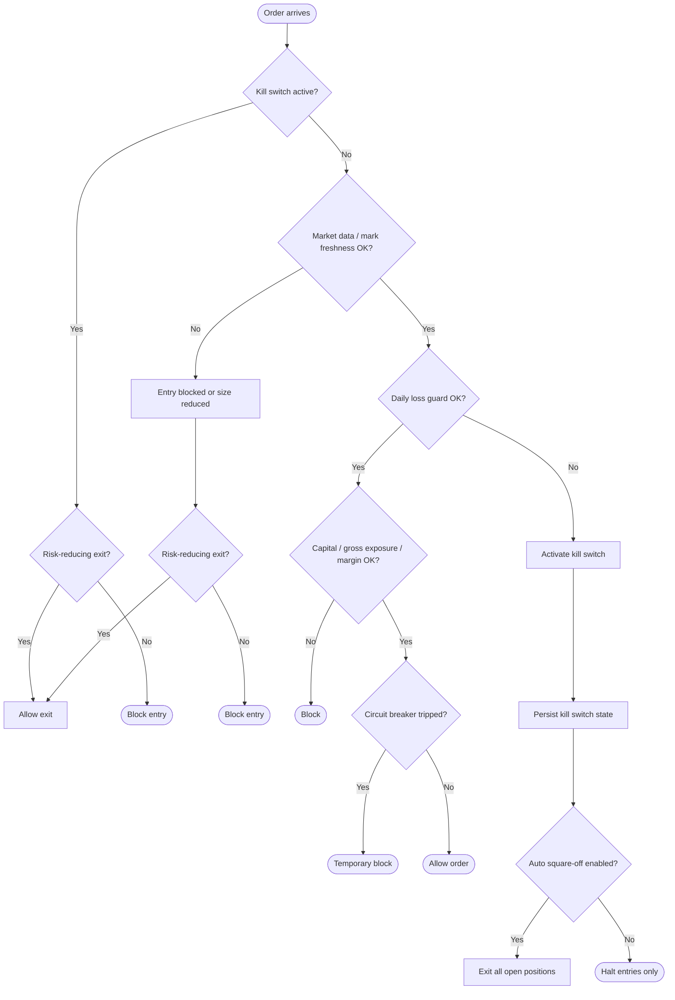

### Risk rules
- Risk logic must document whether unrealized PnL uses bid/ask, LTP, or last valid mark. In the current automated LIVE baseline, that live mark source comes from the stream-worker market-data path.
- Stale quote thresholds must be configurable per instrument class.
- New entries must fail closed when price, capital, margin, or PnL state is unavailable or stale beyond policy.
- Intraday live strategies must have an explicit EOD exit and open-order cancel policy; silent default disablement is forbidden in LIVE.
- Profit-target, profit-lock, and giveback policies must be explicitly configured per strategy/account pair; absence of policy is a startup failure.
- Exits intended to reduce exposure remain allowed even during degraded risk conditions unless broker or compliance rules forbid them.

### 12.1 Kill-switch clear and re-arm semantics

Allowed kill-switch control states:
- `INACTIVE`
- `TRIPPED`
- `CLEAR_PENDING`
- `CLEARED`

State machine (§132 — full transition sequence):

```
INACTIVE --trip--> TRIPPED --request_clear--> CLEAR_PENDING --confirm_clear--> CLEARED --rearm--> INACTIVE
```

Each action is a separate explicit operator call; none happen automatically.
The `rearm` action (§15.4 `KILL_SWITCH_REARM`) requires step-up authorization
and transitions `CLEARED → INACTIVE` to restore full entry eligibility.
`CLEARED` alone does **not** restore entry eligibility — the `rearm` call is
required. See §15.4 for step-up authorization requirements on `KILL_SWITCH_REARM`.

Rules:
- A trip may be scoped `global`, `tenant`, `account`, or `strategy`, and the persisted state must record that scope explicitly.
- Clearing a kill switch never happens implicitly on the next profitable tick, next broker poll, or process restart.
- A clear request requires authenticated and authorized operator action, a reason code, and an audit trail.
- A clear request must fail if required control inputs are stale or unavailable, including broker sync freshness and PnL freshness for the affected scope.
- A clear request must fail while unresolved `RECONCILING`, `ORPHAN_REVIEW`, or other operator-blocking position states remain for the same control scope, unless a separately audited break-glass override is used.
- `CLEAR_PENDING` means the operator requested release but Phoenix is still validating fresh data, unresolved positions, and authoritative store health.
- `CLEARED` returns entry eligibility only to the cleared scope; it does not auto-enable disabled strategies, auto-remove degraded state, or auto-reenter positions.
- Re-arming after `CLEARED` is an explicit `rearm` action (step-up auth required per §15.4) that transitions `CLEARED → INACTIVE` once validation succeeds and the action is durably recorded.
- **Entry eligibility is restored only when state is `INACTIVE`** — not when it is `CLEARED`. Operators must call `rearm` explicitly after `CLEARED`.

---

## 13. ATM Refresh & Position Sync Cycles

```mermaid
flowchart TD
    subgraph ATM Refresh Thread
        ATM_LOOP([atm-refresh every N minutes]) --> CHECK_MARKET{Market open?}
        CHECK_MARKET -- No --> ATM_SLEEP([Sleep])
        CHECK_MARKET -- Yes --> FETCH_ATM[Re-fetch ATM strikes]
        FETCH_ATM --> STRIKES_CHANGED{Strikes changed?}
        STRIKES_CHANGED -- No --> ATM_SLEEP
        STRIKES_CHANGED -- Yes --> REBUILD_META[Rebuild instrument metadata]
        REBUILD_META --> BUILD_REMAP[Build old->new contract remap]
        BUILD_REMAP --> RECONCILE_STATE{Can open state be reconciled?}
        RECONCILE_STATE -- Yes --> APPLY_REMAP[Remap strategy state + subscriptions]
        RECONCILE_STATE -- No --> DEGRADED_ATM[Mark affected strategy/account DEGRADED]
        APPLY_REMAP --> RESUBSCRIBE[Resubscribe WebSocket]
        DEGRADED_ATM --> EXIT_ONLY_MODE[Block new entries, allow safe exits/manual review]
        EXIT_ONLY_MODE --> RESUBSCRIBE
    end

    subgraph Position Sync Thread
        PSYNC_LOOP([position-sync every 60-120s]) --> FETCH_BROKER[Fetch broker positions + orders]
        FETCH_BROKER --> COMPARE[Compare against authoritative internal state]
        COMPARE --> MISMATCH{Mismatch found?}
        MISMATCH -- No --> SYNC_OK([IN_SYNC])
        MISMATCH -- Yes --> CLASSIFY[Classify mismatch evidence]
        CLASSIFY --> STRONG{Strong evidence?}
        STRONG -- Yes --> APPLY_RECON[Apply reconciled mutation + audit]
        STRONG -- No --> MARK_RECON[Mark RECONCILING or ORPHAN_REVIEW]
        MARK_RECON --> BLOCK_NEW[Block new entries for affected contract if needed]
    end
```

### Critical ATM rule
`CLEAR open_legs` is forbidden in production. The fallback is `DEGRADED`, never destructive silent state deletion.

### Critical sync rule
Single-poll auto-register of ghost positions or single-poll auto-remove of stale positions is forbidden by default.
Position sync is not a replacement for the live market-data plane. It refreshes broker inventory and order evidence, but it does not by itself provide fresh ticks, bars, indicators, or non-stale open mark-to-market.

### 13.1 Degraded-entry criteria

The `DegradedScopeManager` (`app/core/degraded_scope_manager.py`) is the single component responsible for tracking which scopes are in `DEGRADED` state and enforcing entry/exit/recovery criteria described in §13.1–13.3. All components that need to check or update degraded status must go through this manager rather than tracking state independently.

Phoenix must place an affected strategy/account/contract scope into `DEGRADED` when any of the following occur:
- ATM remap fails or remains ambiguous for an active or recently active `OwnershipKey`
- Internal position state and broker evidence diverge beyond reconciliation threshold
- Ownership cannot be derived or verified for a live contract
- Lifecycle state is stuck in `UNKNOWN`, `RECONCILING`, or non-terminal ambiguity beyond policy threshold
- Quote freshness, contract metadata, or broker evidence is insufficient to safely size or route a new entry

In `DEGRADED`:
- Fresh entries for the affected scope are blocked.
- Risk-reducing exits remain allowed if ownership and broker routing are still safe.
- Manual review and audited break-glass actions remain available under policy.

### 13.2 Degraded-exit criteria
Phoenix must also restrict routine exits when:
- The system cannot map the exit request to a normalized `OwnershipKey`.
- The intended exit would increase net exposure because quantity direction is uncertain.
- Broker route, contract metadata, or lifecycle state is too ambiguous to prove the action is risk-reducing.

When those conditions apply:
- The system remains `DEGRADED`.
- Automated exit logic pauses for that scope.
- Only operator-reviewed or audited break-glass actions may proceed.

### 13.3 Degraded recovery criteria
A scope may leave `DEGRADED` only when all of the following are true:
- Normalized `OwnershipKey` derivation is restored.
- Required broker evidence is fresh and internally consistent.
- Lifecycle state for affected orders is terminal or reconciled.
- Internal position state is `OPEN`, `PARTIALLY_EXITED`, or `FLAT` without unresolved ambiguity.
- The recovery decision is durably recorded and auditable.

Recovery may be automatic only if the policy and evidence class are explicitly configured; otherwise it requires operator approval.

---

## 14. Hub Multi-Tenant Architecture

```mermaid
flowchart TD
    subgraph Hub Controller
        HUB([Hub]) --> RECONCILE_LOOP[Reconcile configured runners]
        RECONCILE_LOOP --> FOR_EACH[For each active broker account]
        FOR_EACH --> HAS_RUNNER{Runner exists?}
        HAS_RUNNER -- No --> CREATE_RUNNER[Create AccountRunner + BrokerClient]
        HAS_RUNNER -- Yes --> UPDATE_RUNNER[Refresh config / subscriptions]
        CREATE_RUNNER --> START_RUNNER[Start AccountRunner]
        UPDATE_RUNNER --> CHECK_STALE
        START_RUNNER --> CHECK_STALE
        CHECK_STALE --> STOP_STALE[Stop deactivated runners]
    end

    subgraph Watchdogs
        WATCHDOG_LOOP([Subscription watchdog]) --> RE_RECONCILE[Reconcile accounts]
        PROFIT_LOOP([Profit watchdog]) --> SWEEP_ALL[maybe_sweep_for_runners]
        SWEEP_ALL --> EOD_ALL[maybe_exit_for_runners]
    end

    subgraph AccountRunner
        RUNNER([AccountRunner]) --> POLL_BALANCE[Poll broker balance]
        POLL_BALANCE --> POLL_POSITIONS[Poll broker positions]
        POLL_POSITIONS --> POLL_ORDERS[Poll broker orders]
        POLL_ORDERS --> FEED_LIFECYCLE[Feed lifecycle evidence]
    end
```

### AccountRunner rule
Runner polling is an evidence feed into authoritative services. It must not bypass `OrderLifecycleService` or ownership policy.

---

## 15. Dashboard & API Layer

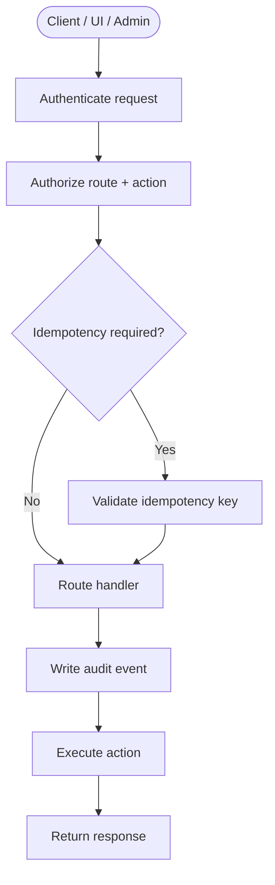

### Required API control rules
The following endpoints require authentication, role-based authorization, and audit logging:
- strategy toggles
- kill switch activation / release
- runtime config override
- manual sweep
- manual EOD exit
- any route that changes live risk, positions, or account behavior

### Required audit fields
- actor identity
- route/action
- request id
- idempotency key if present
- before/after value snapshot for mutable settings
- timestamp
- target tenant/account/strategy
- result: accepted, rejected, failed

### Dashboard delivery contract
- `/ws/dashboard` may support either `full_snapshot` or `delta` mode.
- Default production mode should prefer deltas plus periodic compaction snapshot.
- Dashboard is derived only and must tolerate dropped frames.
- UI must not treat dashboard absence as authoritative flat/closed proof.
- In the current automated LIVE baseline, fresh dashboard LTP and open PnL depend on the stream-worker-fed mark cache. Disabling the stream worker without a replacement mark-price plane is expected to degrade dashboard freshness and open mark-to-market accuracy.

### LIVE control-plane security rules
- `dashboard_auth_disabled=true` is forbidden in LIVE.
- Demo auth routes, local test users, and developer shortcuts must be disabled in LIVE.
- Break-glass and manual exit routes require elevated role checks, reason codes, and audit trails.
- Control-plane secrets must come from an approved platform secret store; repo/env-file fallback is forbidden in LIVE. Broker credentials may use Postgres `broker_credentials`.

### 15.4 Step-up authorization

Production contract: dangerous privileged actions require a step-up token (`app/security/step_up.py`) in addition to normal RBAC:

**Covered action classes** (from `DangerousActionClass` enum):
- `KILL_SWITCH_CLEAR` / `KILL_SWITCH_REARM`
- `STRATEGY_ENABLE` / `STRATEGY_DISABLE`
- `CAPITAL_LIMIT_CHANGE`
- `BREAK_GLASS`
- `RUNTIME_CONFIG_OVERRIDE`

Step-up tokens are short-lived (5-minute TTL), single-use, and bound to a specific action class. They are issued by re-authentication and stored in-memory with optional Postgres persistence. Alternatively, a **maker-checker** approval record (`ApprovalWorkflow`, §22.3) signed by a second admin may substitute for a step-up token.

Current implementation evidence: `break-glass/flatten` enforces `step_up_token` in LIVE, but the repo contains no HTTP endpoint that issues the token. `kill-switch/rearm` currently requires OPERATOR role only and does not enforce step-up. These are production readiness gaps against this contract, not approved alternate behavior.

The `Entitlements` module (`app/security/entitlements.py`) gates fine-grained action permissions by role, tenant, and account scope, independent of the coarse RBAC layer in §15.

---

### 15.1 Secret Management and Credential Hygiene

- All broker, admin, database, HMAC, and runtime-override secrets must be sourced from an approved platform secret store in LIVE; broker credentials may also be sourced from Postgres.
- Any secret ever committed to the repository or otherwise exposed must be treated as compromised and rotated before deployment.
- Secrets must be environment-scoped and role-scoped. Shared cross-environment credentials are forbidden.
- Short-lived injected environment variables may transport secret values at runtime, but local env files are dev-only and forbidden in live deployment artifacts.
- Secret access, rotation, and override events must be auditable.

### 15.2 Future Secret and Storage Roadmap

The planned scale roadmap is:

- **Google Secret Manager + Cloud Run** -- add a cloud-native deployment path where LIVE secrets are fetched from Google Secret Manager and Phoenix runs on Cloud Run.
- **Firestore for broker secrets** -- add a document-backed broker-secret storage option for cloud-native secret metadata and rotation workflows.
- **BigQuery expansion** -- evaluate BigQuery as a broader persistence target for analytics and selected Postgres-backed workloads, but only after equivalent authoritative-state guarantees are defined.

### 15.3 Observability, Alerting, and SLOs

Phoenix must emit structured logs, metrics, traces, and audit events for all authoritative state transitions.

### Required alerts
- Stale quote age breach
- Stale broker position/order sync age
- Orders stuck in `SUBMITTING`, `OPEN`, `PARTIAL_FILL`, or `RECONCILING`
- Reconciliation backlog or orphan-review backlog growth
- Outbox replay backlog after restart
- Ownership conflict spikes
- Deadletter growth
- Dashboard freshness lag while runtime remains healthy
- Leader lease renewal failure or fencing event

### Minimum operational SLOs
- Quote freshness by instrument class
- Broker sync latency by account
- Order intent to broker acknowledgement latency
- Terminal lifecycle convergence time
- Reconciliation backlog age
- Outbox recovery completion time after restart

---

## 16. Shutdown, Lease Loss, and Recovery Guarantees

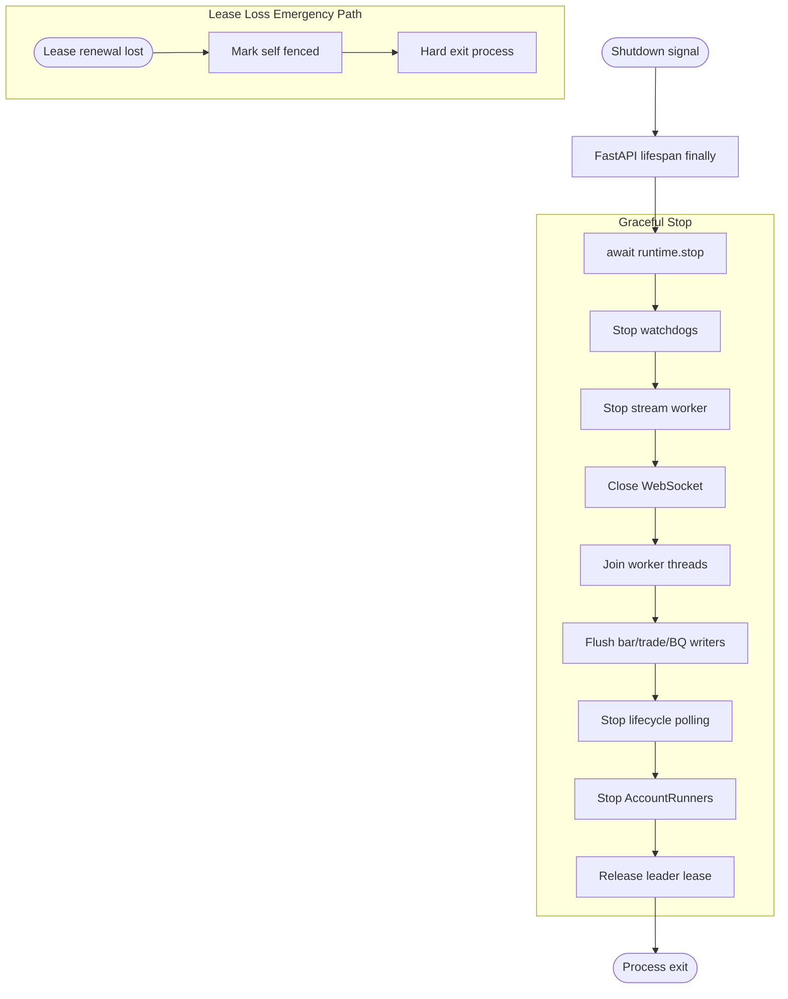

### Recovery guarantees after graceful stop
On restart, the system must recover by:
- Loading persisted authoritative state
- Reconciling broker orders/positions
- Resuming lifecycle polling
- Evaluating pending outbox entries
- Releasing stale ownership locks only through reconciliation rules

### Recovery guarantees after lease loss
A hard exit is acceptable only if restart logic guarantees:
- Fencing prevents duplicate active writers
- Stale ownership locks are recoverable
- Pending outbox items are replay-safe
- Broker reconciliation runs before replay

### 16.1 Deployment and cutover policy
- Only one active writer may control a given live environment, tenant set, or account scope at a time.
- Blue/green or canary deployments must complete startup reconciliation before accepting live order flow.
- The old writer must drain and relinquish its lease before the new writer becomes authoritative.
- Rollback procedures must preserve durable outbox, lifecycle, ownership, and kill-switch state and must not create duplicate writers.

### 16.2 Failure drills and chaos testing
- Postgres or equivalent authoritative storage must have automated backups and point-in-time recovery where supported.
- Restore drills must be executed on a defined schedule and treated as release evidence.
- Chaos tests must cover broker outage, database outage, lease loss, network partition, and restart during pending submission.
- Recovery objectives (RTO/RPO) must be declared and verified against drill results.

---

## 17. End-to-End Trade Lifecycle

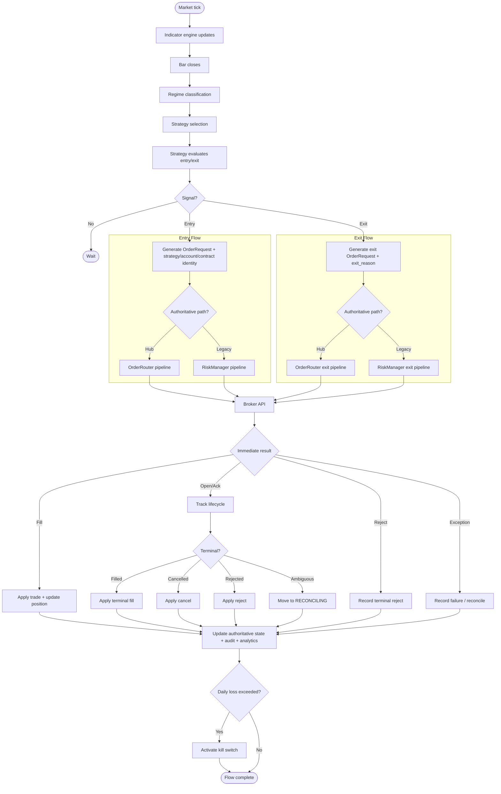

### End-to-end authority note
In the hub-authoritative automated profile, stream-side strategies may still generate entry and exit signals, but those signals must route through `HUB_PATH`. `LEGACY_PATH` exists only for legacy-authoritative deployments or for audited break-glass handling.

---

## 18. Data Persistence Architecture

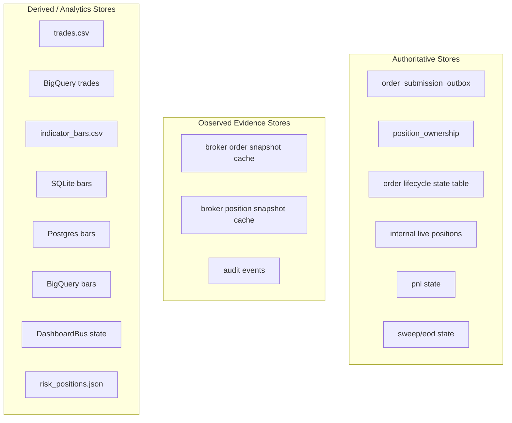

### Persistence rules
- CSV, BigQuery, dashboard, and JSON restart helpers are **never** the authority for live order-routing decisions.
- In-memory fallbacks must be disabled in LIVE for outbox, lifecycle, ownership, kill-switch state, and processed markers.
- Local JSON helpers may assist restart review but may not auto-adopt or auto-flatten without reconciliation evidence.
- Every authoritative mutation must be auditable.

### 18.1 Backup, Restore, and Disaster Recovery
- Authoritative Postgres data must have automated backup coverage and point-in-time recovery where supported.
- Schema migrations must be validated before workers start; incompatible schema should fail startup.
- Restore procedures must be documented, exercised, and measured.
- Recovery targets for order flow, reconciliation, and dashboard freshness must be defined and reviewed.

---

## 19. Thread / Process Architecture

```
Process: python -m app.main
├── Main Thread / Event Loop
│   ├── FastAPI HTTP handlers
│   ├── WebSocket /ws/dashboard
│   ├── Hub asyncio tasks (if enabled)
│   │   ├── AccountRunner tasks
│   │   ├── OrderLifecycleService polling
│   │   ├── Subscription watchdog
│   │   ├── Profit watchdog
│   │   └── Leader lease renewal task
│   └── Control-plane authn/authz/audit middleware
│
├── Thread: stream-worker
│   └── stream_multi_instruments()
│       ├── Thread: ws-runner
│       ├── Thread: atm-refresh
│       ├── Thread: position-sync
│       └── Thread: stream-event-queue
│
├── Thread: stream-watchdog
│   └── Worker monitoring + controlled restart
│
├── Thread: bq-async-writer
│   └── Batched analytics writes
│
└── Thread/task: leader-lease-renew
    └── Fencing lease renewal + hard-exit on loss
```

---

### 19.1 Runtime Decomposition Target

For scale, reliability, and change safety, Phoenix should continue moving toward explicit component boundaries for:
- Market-data ingestion and normalization
- Indicator and bar computation
- Strategy evaluation
- Order routing and lifecycle management
- Broker reconciliation and position sync
- Exit policy engines

These components may co-reside initially, but their contracts must be explicit and shared mutable state must be minimized.

### 19.2 Same-scope mutation serialization

All authoritative mutations for the same `OwnershipKey` must be serialized through a single scope-level executor, mailbox, transactional lock, or equivalent single-writer mechanism.

This is implemented by `ScopeSerializer` (`app/orders/scope_serializer.py`), which provides per-`OwnershipKey` async executors. All components that need to mutate authoritative state for a scope must submit through `ScopeSerializer` rather than mutating directly.

Required rule:
- Strategy evaluation, lifecycle polling, reconciliation, ATM refresh recovery, position sync, and control-plane actions may propose mutations, but only the serialized scope mutator may commit them.

Minimum conflict policy (highest priority first):
1. Risk-reducing break-glass or forced-flatten actions
2. Terminal lifecycle/fill evidence
3. Reconciliation decisions
4. Routine strategy exits
5. Fresh strategy entries

No component may directly mutate authoritative state for a scope while another authoritative mutation for the same scope is in flight outside this serialization boundary.

### 19.3 Authoritative-state anti-patterns (forbidden)

`AntiPatternGuards` (`app/core/anti_pattern_guards.py`) and `P0OperationalGuards` (`app/core/p0_operational_guards.py`) provide runtime assertions that detect and log violations of these rules in production. They do not replace architecture enforcement but provide a second line of defense.

The following are forbidden in production unless a narrowly scoped emergency flag and audit policy explicitly say otherwise:
- Direct create/delete of authoritative positions from one broker poll
- Direct ownership release from ATM refresh, dashboard actions, or raw account-runner polling
- Using display labels, UI aliases, or ATM labels as ownership identity
- Clearing live option legs or position records because remap failed
- Treating dashboard silence or UI flat state as proof of broker flatness
- Replaying pending submissions before restored state and broker reconciliation complete
- Allowing multiple writers to mutate the same `OwnershipKey`
- Allowing strategy code, position sync, or admin handlers to bypass lifecycle durability or ownership policy
- Auto-clearing kill switch on restart or on a single favorable PnL update
- Silently converting unresolved ambiguity into `FLAT`, `NONE`, or released ownership

---

## 20. P0 Operational Rules

1. One authoritative live state path at a time.
2. Broker snapshots are evidence, not direct canonical mutation input.
3. Persisted authoritative state is restored before broker reconciliation; replay happens only after reconciliation-first recovery evaluation.
4. `CLEAR open_legs` is not allowed in production.
5. Single-poll ghost create/delete is not allowed by default.
6. Ownership release requires confirmed terminal non-fill or confirmed flat state.
7. Exit orders must persist explicit exit reasons.
8. Control routes require authn, authz, idempotency where needed, and audit logging.
9. Dashboard data is derived and non-authoritative.
10. Recovery after graceful stop or lease loss must be replay-safe and reconciliation-first.
11. LIVE startup must hard-fail on insecure auth mode, missing secrets, missing durable backends, or disabled mandatory controls.
12. Hub-authoritative LIVE mode forbids legacy automated exits except audited break-glass.
13. New entries fail closed on stale or missing price, capital, margin, or PnL state.
14. Approved platform secret storage is mandatory in LIVE; Postgres is allowed for broker credentials. Committed or env-file secrets are forbidden.
15. Durable idempotency, lifecycle, ownership, kill-switch, and processed-trade markers are mandatory in LIVE.
16. Observability, alerts, restore drills, and failure-path testing are part of production readiness, not optional operations work.
17. Internal position states must be explicit and durable; narrative-only position handling is not sufficient.
18. `OwnershipKey` scope must be canonical, normalized, and derived independently of UI labels.
19. Same-scope authoritative mutations must be serialized through one writer boundary.
20. `DEGRADED`, `RECONCILING`, `ORPHAN_REVIEW`, and kill-switch `CLEAR_PENDING` states must block unsafe fresh entries until explicitly resolved.
21. Components that are not the authoritative mutator may propose state changes but may never commit authoritative state directly.

---

## 21. Production Readiness Release Gates

### P0 -- required before live trading
1. LIVE startup gate enforced in code and deployment manifests.
2. Secret rotation completed for any previously exposed credentials.
3. Single authoritative order and exit path enforced for each live scope.
4. Durable store enforcement completed for outbox, lifecycle, ownership, kill switch, EOD, and sweep state.
5. Replay, reconciliation, crash, and lease-loss tests passed.
6. Explicit internal position states implemented and tested.
7. Canonical `OwnershipKey` derivation implemented and validated across strategy, lifecycle, and reconciliation paths.
8. Same-scope mutation serialization enforced for authoritative writers.
9. Kill-switch clear workflow implemented with scope, freshness checks, and audit requirements.
10. `DEGRADED` entry/exit/recovery criteria implemented and operator-visible.

### P1 -- immediate hardening after go-live candidate
1. Alert routing, dashboards, and SLO review in place.
2. Operator workflow for `RECONCILING` and `ORPHAN_REVIEW` documented and exercised.
3. Blue/green or canary cutover playbook validated.
4. Restore drill evidence captured and reviewed.
5. Anti-pattern guardrails and runtime assertions added for non-authoritative mutation attempts.

### P2 -- scale and simplification roadmap
1. Further decompose the monolithic stream runtime into clearer components.
2. Reduce shared mutable state between stream, hub, and broker-sync paths.
3. Isolate strategy evaluation from broker reconciliation and lifecycle polling.

---

## 22. Adaptive Strategy Subsystem

`app/strategies/adaptive/` implements the regime-driven strategy selection layer referenced in §7–8 diagrams.

### 22.1 Regime Classification

`RegimeClassifier` (`adaptive/regime.py`) evaluates a `MarketContext` snapshot on each bar close and classifies market conditions into one of five regimes:

| Regime | Meaning |
|---|---|
| `TRENDING` | Strong directional trend (high ADX, DI spread) |
| `NORMAL` | Moderate conditions, strategies may run normally |
| `CHOPPY` | Low ADX, tight DI spread; mean-reversion conditions |
| `HIGH_VOL` | ATR norm spike; position sizing constrained |
| `NO_TRADE` | Conditions too adverse; entries blocked |

Classification uses ADX, DI spread, ATR norm, EMA slope, and a configurable hold-bars hysteresis to prevent rapid regime flipping.

### 22.2 Strategy Selection

`StrategySelector` (`adaptive/strategy_selector.py`) maps the current `Regime` to an ordered list of candidate strategies from the routing table. It:
- Reads `AUTO_STRATEGY_SELECT_ENABLED` to determine whether selection is automatic or operator-controlled.
- Evicts prior-day selection state at IST midnight on the first `on_bar` call (the selector staleness guard from §5.3).
- Filters out strategies absent from the routing table before returning candidates.

### 22.3 Dynamic Policy Engine

`DynamicPolicy` (`adaptive/dynamic_policy.py`) adjusts per-strategy parameters (position size multipliers, SL/TP offsets, cooldowns) at runtime based on the current regime and recent performance context. Policy updates are applied without restart and are recorded for audit.

### 22.4 Market Context

`MarketContext` (`adaptive/market_context.py`) aggregates the indicator snapshot used by both `RegimeClassifier` and `DynamicPolicy`. It is updated on every bar close by the stream worker.

---

## 23. Autonomy Envelope (PHX-STRAT-005)

`AutonomyEnvelope` and `AutonomyEnvelopeRegistry` (`app/strategies/autonomy_envelope.py`) provide per-strategy hard-stop guardrails that are independent of the hub risk pipeline.

Each strategy is assigned an envelope with the following limits:

| Limit | Parameter | Enforcement |
|---|---|---|
| Max deployed capital | `max_capital_deployed` | Checked before every entry intent |
| Max daily turnover | `max_daily_turnover` | Cumulative notional per IST day |
| Trading time window | `allowed_time_start` / `allowed_time_end` | IST time bounds |
| Symbol allowlist | `allowed_symbols` | Per-tick symbol validation |
| Max drawdown | `max_drawdown_pct` | Fraction of capital; triggers auto-disable |

When **any** envelope limit is breached:
1. `EnvelopeBreach` exception is raised and caught by the caller.
2. The strategy is automatically disabled via the strategy switch.
3. A kill-switch trip is emitted for the strategy scope.
4. An audit event is written.

The registry (`AutonomyEnvelopeRegistry`) holds one envelope per strategy ID and is queried before order submission. Envelope state is not a substitute for hub risk checks — both layers must pass.

---

## 24. Decision Lineage (PHX-AUD-002)

`DecisionLineage` (`app/core/decision_lineage.py`) creates a per-order audit trail that traces every order back to the full decision context at the moment of submission.

### What is recorded

Each `DecisionLineage` record links an `order_intent_id` to:
- `strategy_id` and `strategy_version`
- Signal values that triggered the decision (entry/exit indicators, regime)
- Active `Regime` at decision time
- Risk check results (`RiskCheckResult` list) — each check: name, passed/failed, value, limit
- Execution outcome (terminal lifecycle state, fill price, slippage)

### Storage

Records are written to:
1. The structured audit log immediately on creation.
2. The `trade_decision_lineage` Postgres table for dashboard queries and compliance review.

An in-memory LRU cache (`_LINEAGE_CACHE`, max 2000 entries) allows fast API reads without a DB round-trip.

### Usage rule

Every order created via the hub router must have a corresponding `DecisionLineage` record. Lineage is created in the `CREATED` state and updated at terminal state. Orders without lineage records are a compliance gap.

---

## 25. Approval Workflow (PHX-AUD-003)

`ApprovalWorkflow` (`app/core/approval_workflow.py`) enforces maker-checker controls for production configuration and strategy changes.

### Change kinds requiring approval

| `ChangeKind` | Examples |
|---|---|
| `STRATEGY_CONFIG` | strategy parameter updates |
| `CAPITAL_LIMIT` | per-account or per-strategy capital cap changes |
| `RISK_POLICY` | SL/TP policy, daily-loss threshold changes |
| `FEATURE_FLAG` | runtime feature flag overrides |
| `STRATEGY_ENABLE` / `STRATEGY_DISABLE` | toggling a strategy in LIVE |
| `GENERAL_CONFIG` | other runtime config changes |

### Approval states

`PENDING → APPROVED | REJECTED | SUPERSEDED | WITHDRAWN`

Rules:
- The approver must be a different identity from the requester.
- On `APPROVED`, the change is applied and the full before/after diff is stored.
- Rollback to the prior approved version is supported.
- All decisions are emitted as audit events.
- Open `PENDING` requests for the same change target supersede each other on new submission.

---

## 26. Rollout Ladder (PHX-SIM-005)

`RolloutLadder` (`app/simulation/rollout_ladder.py`) governs the staged promotion of strategies from simulation to full live deployment.

### Rollout states

`DISABLED → PAPER → SHADOW → MICRO_LIVE → CAPPED_LIVE → SCALED_LIVE`

| State | Capital fraction | Description |
|---|---|---|
| `DISABLED` | 0% | Strategy not running |
| `PAPER` | 0% | Simulated fills against real prices |
| `SHADOW` | 0% | Full order generation but broker orders not submitted |
| `MICRO_LIVE` | 5% | Live broker orders at reduced capital |
| `CAPPED_LIVE` | 25% | Live with a capital ceiling |
| `SCALED_LIVE` | 100% | Full live deployment |

### Promotion rules

Promotion to the next state requires:
1. **Quantitative criteria** (`PromotionCriteria`): minimum days in current state, minimum trade count, maximum drawdown, minimum Sharpe, minimum fill rate.
2. **Operator approval** (maker-checker via `ApprovalWorkflow`, §25) — always required for any live state.
3. A durable audit record of the promotion decision.

### Demotion

Any state may be demoted to `DISABLED` at any time. Live states (`MICRO_LIVE`, `CAPPED_LIVE`, `SCALED_LIVE`) auto-demote to `DISABLED` on an `AutonomyEnvelope` breach (§23).

---

## 27. Execution Quality Tracking (PHX-EXEC-004)

`SlippageTracker` (`app/orders/slippage_tracker.py`) measures per-order execution quality and persists the data for operational review.

### Metrics captured per order

| Metric | Definition |
|---|---|
| Arrival price | Mid-price at the moment of order submission |
| Fill price | Actual average fill price |
| Implementation shortfall | `(fill_price − arrival_price) / arrival_price × 10000` bps |
| Fill ratio | `fill_qty / intended_qty` |
| Time-to-fill | Seconds from submission to terminal fill event |

### Storage

`SlippageRecord` objects are stored in a bounded in-memory ring (max 5000 records) and exported to Prometheus for dashboarding. Records are also persisted to Postgres for dashboard queries.

### Usage rule

`SlippageTracker` is updated by the hub lifecycle service on every terminal fill. High implementation shortfall or low fill ratio trends for a strategy are signals for position sizing or routing review.
