# Phoenix v9 -- Complete Application Flow

> **Backend note:** The bundled Docker/Desktop LIVE path uses Postgres for all durable backends
> (leader lease, sweep state, control plane, PnL). Firestore references in this diagram apply
> to the Cloud Run / GCP deployment path only. Both paths share the same application code;
> the backend is selected by `LEADER_LEASE_BACKEND`, `CONTROL_PLANE_BACKEND`, etc.

## 1. System Boot & Initialization

```mermaid
flowchart TD
    START([python -m app.main]) --> LOAD_ENV[_load_cloudrun_env_if_local<br/>Load .env / localrun.env / cloudrun.env]
    LOAD_ENV --> CONFIG_LOG[_configure_logging<br/>Setup console + rotating file handlers]
    CONFIG_LOG --> PORT_CHECK{_preflight_port_bind<br/>Port available?}
    PORT_CHECK -- No --> EXIT_FAIL([sys.exit 1])
    PORT_CHECK -- Yes --> UVICORN[uvicorn.run app.server:app<br/>host:port]

    UVICORN --> LIFESPAN[FastAPI lifespan context manager]
    LIFESPAN --> GET_RUNTIME[get_app_runtime singleton<br/>Creates AppRuntime]
    GET_RUNTIME --> RUNTIME_START[await runtime.start]

    subgraph AppRuntime.start
        RUNTIME_START --> BOOT_CFG[initialize_boot_config<br/>Load strategy_env.yaml,<br/>universe.yaml, settings]
        BOOT_CFG --> FEATURE_FLAGS[load_stability_feature_flags<br/>CAPITAL_MARGIN_CHECK_MODE, etc.]
        FEATURE_FLAGS --> SCHEMA_CHECK[check_startup_schema<br/>Verify Postgres tables/indexes]
        SCHEMA_CHECK --> VALIDATE{LIVE mode?}
        VALIDATE -- Yes --> STRICT_VALIDATE[validate_runtime_startup_settings<br/>validate_startup_config<br/>Strict schema check]
        VALIDATE -- No --> LEADER_CHECK
        STRICT_VALIDATE --> LEADER_CHECK

        LEADER_CHECK{Leader lease<br/>enabled?}
        LEADER_CHECK -- Yes --> ACQUIRE_LEASE[LeaderLease.start<br/>Postgres or Firestore transactional lease]
        LEADER_CHECK -- No --> IS_LEADER[is_leader = True]
        ACQUIRE_LEASE --> LEASE_RESULT{Lease acquired?}
        LEASE_RESULT -- Yes --> IS_LEADER
        LEASE_RESULT -- No --> NOT_LEADER[Standby mode:<br/>no workers started]

        IS_LEADER --> WORKER_CHECK{disable_stream_worker?}
        WORKER_CHECK -- Yes --> BQ_START
        WORKER_CHECK -- No --> START_WORKER[StreamWorker.start<br/>Background thread]
        START_WORKER --> START_WATCHDOG[WorkerWatchdog.start<br/>Monitor thread every 15s]
        START_WATCHDOG --> BQ_START

        BQ_START[start_global_writer<br/>BigQuery async writer]
        BQ_START --> HUB_CHECK{enable_multi_hub?}
        HUB_CHECK -- No --> RUNTIME_READY([Runtime Ready])
        HUB_CHECK -- Yes --> HUB_INIT
    end

    subgraph HubRuntime Init
        HUB_INIT[get_hub_runtime singleton] --> CREATE_ENGINES[Create CapitalEngine,<br/>PnLEngine, RiskEngine,<br/>ProfitEngine]
        CREATE_ENGINES --> CREATE_OWNERSHIP[build_position_ownership_store<br/>build_order_submission_outbox]
        CREATE_OWNERSHIP --> CREATE_HUB[Hub + StateStore]
        CREATE_HUB --> CREATE_LIFECYCLE[OrderLifecycleService]
        CREATE_LIFECYCLE --> CREATE_CB[TradingCircuitBreaker<br/>Wire fault tracker]
        CREATE_CB --> CREATE_ROUTER[OrderRouter<br/>Wire all engines]
        CREATE_ROUTER --> CREATE_SWEEP[SweepStateManager<br/>EODStateManager<br/>Postgres or Firestore]
        CREATE_SWEEP --> CREATE_EXIT_ENGINES[ProfitSweepEngine<br/>EODExitEngine]
        CREATE_EXIT_ENGINES --> HUB_INITIALIZE[hub.initialize<br/>Load tenants, broker accounts]
        HUB_INITIALIZE --> HUB_START_ALL[hub.start_all<br/>Start AccountRunners]
        HUB_START_ALL --> LIFECYCLE_START[order_lifecycle.start<br/>Begin polling broker statuses]
        LIFECYCLE_START --> OUTBOX_RECOVER[recover_submission_outbox<br/>Replay PENDING orders]
        OUTBOX_RECOVER --> RUNTIME_READY
    end
```

## 2. Stream Worker Initialization (Current Market-Data & Strategy Path)

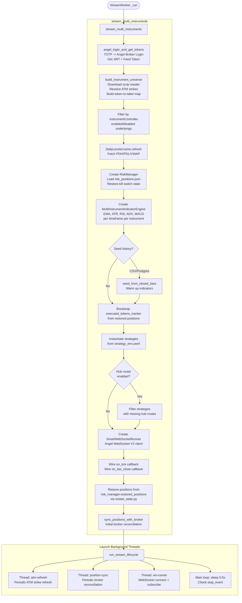

## 3. Market Data Flow (Tick Processing)

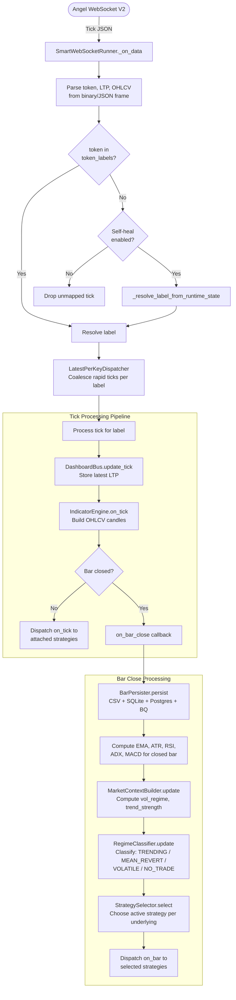

## 4. Strategy Signal Generation

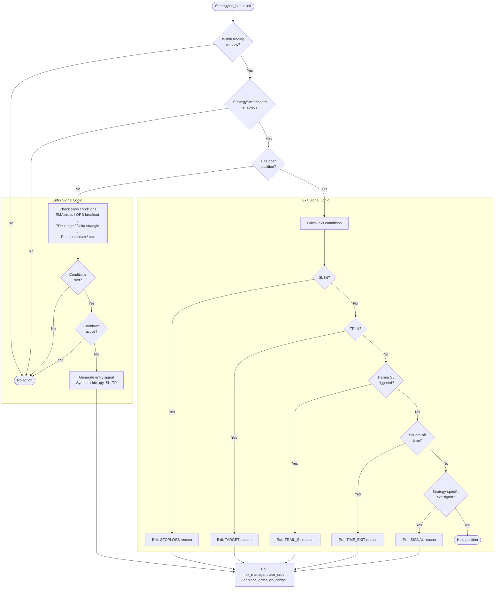

## 5. Order Lifecycle (Legacy Path via RiskManager)

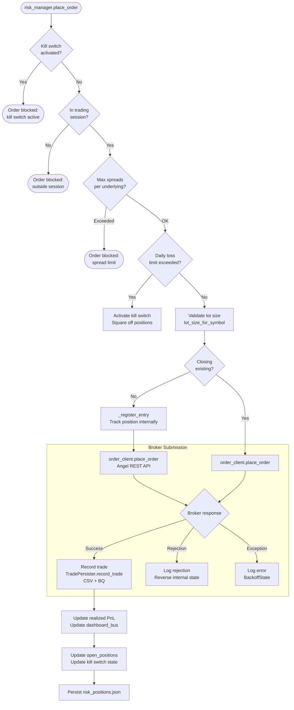

## 6. Order Lifecycle (Hub Path via OrderRouter)

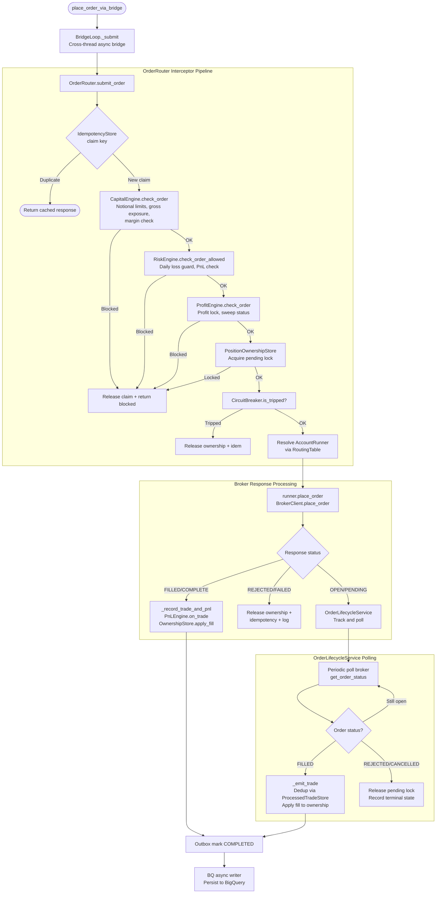

## 7. Risk Management & Kill Switch Flow

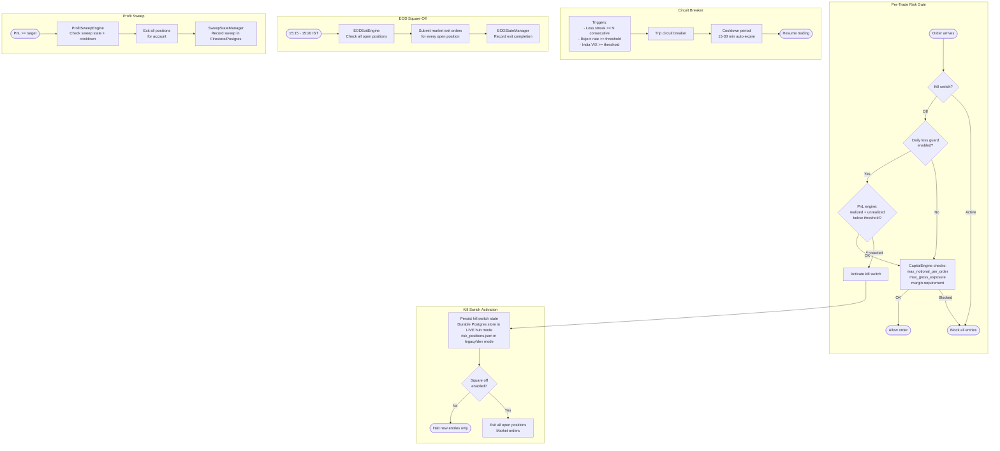

## 8. ATM Refresh & Position Sync Cycles

```mermaid
flowchart TD
    subgraph ATM Refresh Thread
        ATM_LOOP([atm-refresh thread<br/>Every N minutes]) --> CHECK_MARKET{Market<br/>open?}
        CHECK_MARKET -- No --> ATM_SLEEP([Sleep])
        CHECK_MARKET -- Yes --> FETCH_ATM[Re-fetch ATM strikes<br/>from Angel API]
        FETCH_ATM --> STRIKES_CHANGED{ATM strikes<br/>changed?}
        STRIKES_CHANGED -- No --> ATM_SLEEP
        STRIKES_CHANGED -- Yes --> REBUILD_META[Rebuild instrument_meta<br/>New labels, new tokens]
        REBUILD_META --> REFRESH_STRATEGIES[_refresh_strategy_instances_after_atm_update]
        REFRESH_STRATEGIES --> RECONCILE{Strategy has<br/>reconcile_open_legs?}
        RECONCILE -- Yes --> REBOUND[Reconcile: map old labels<br/>to new labels]
        RECONCILE -- No --> DEGRADED_ATM[Mark strategy/account scope DEGRADED<br/>Block entries; allow safe exits or manual review]
        REBOUND --> RESUBSCRIBE[Resubscribe WebSocket<br/>to new token list]
        DEGRADED_ATM --> RESUBSCRIBE
    end

    subgraph Position Sync Thread
        PSYNC_LOOP([position-sync thread<br/>Every 60-120s]) --> FETCH_BROKER[order_client.get_positions<br/>Fetch broker-side positions]
        FETCH_BROKER --> COMPARE[Compare broker positions<br/>vs risk_manager.open_positions]
        COMPARE --> GHOST{Ghost positions?<br/>Broker has, we don't}
        GHOST -- Yes --> REGISTER_GHOST[Register in risk_manager<br/>as BROKER_SYNC]
        GHOST -- No --> STALE{Stale positions?<br/>We have, broker doesn't}
        STALE -- Yes --> REMOVE_STALE[Remove from<br/>risk_manager]
        STALE -- No --> SYNC_OK([Positions in sync])
    end
```

> **Architecture note — Position Sync Thread:** The ghost-registration and single-poll removal paths shown above are the **legacy stream-side** code (`risk_manager` / `restart_state.py`). In the current hub-authoritative LIVE mode, ARCHITECTURE.md §19.3 and P0 rule 5 forbid single-poll ghost creation or removal without reconciliation evidence. The authoritative sync path is the hub `AccountRunner` → `OrderLifecycleService` / `PositionOwnershipStore` flow governed by reconciliation rules in §11. The stream-side paths shown here exist only for the legacy authority path and for restart-helper seeding.

## 9. Hub Multi-Tenant Architecture

```mermaid
flowchart TD
    subgraph Hub Controller
        HUB([Hub]) --> RECONCILE_LOOP[_reconcile_runners_once<br/>Load tenants from control plane<br/>(Postgres or Firestore per CONTROL_PLANE_BACKEND)]
        RECONCILE_LOOP --> FOR_EACH[For each active<br/>broker account]
        FOR_EACH --> HAS_RUNNER{Runner<br/>exists?}
        HAS_RUNNER -- No --> CREATE_RUNNER[Create AccountRunner<br/>Create BrokerClient via factory]
        HAS_RUNNER -- Yes --> UPDATE_RUNNER[Update subscription<br/>mode if changed]
        CREATE_RUNNER --> START_RUNNER[Start AccountRunner<br/>asyncio task]
        UPDATE_RUNNER --> CHECK_STALE
        START_RUNNER --> CHECK_STALE

        CHECK_STALE[Check for removed accounts] --> STOP_STALE[Stop runners for<br/>deactivated accounts]
    end

    subgraph Subscription Watchdog
        WATCHDOG_LOOP([_subscription_watchdog_loop<br/>Every 60s]) --> RE_RECONCILE[Call _reconcile_runners_once<br/>Detect new/removed accounts]
    end

    subgraph Profit Watchdog
        PROFIT_LOOP([_profit_watchdog_loop<br/>Every 30s]) --> SWEEP_ALL[ProfitSweepEngine<br/>maybe_sweep_for_runners]
        SWEEP_ALL --> EOD_ALL[EODExitEngine<br/>maybe_exit_for_runners]
    end

    subgraph AccountRunner
        RUNNER([AccountRunner]) --> POLL_BALANCE[Poll broker balance<br/>Update StateStore]
        POLL_BALANCE --> POLL_POSITIONS[Poll broker positions<br/>Update StateStore]
        POLL_POSITIONS --> POLL_ORDERS[Poll broker orders<br/>Feed OrderLifecycleService]
    end
```

## 10. Dashboard & API Layer

```mermaid
flowchart TD
    subgraph Core Endpoints
        HEALTH[GET /health<br/>Liveness probe]
        READY[GET /ready<br/>Readiness probe]
        HEALTH_SUMMARY[GET /health/summary<br/>Startup and dependency summary]
        METRICS[GET /metrics<br/>Prometheus metrics]
        POSITIONS[GET /positions<br/>Open positions - legacy compat]
    end

    subgraph Admin Routes -- prefix /admin
        STRATEGIES[GET /admin/strategies<br/>Strategy list]
        TOGGLE[POST /admin/strategies/toggle<br/>Enable/disable strategy]
        INSTRUMENTS[GET /admin/instruments<br/>Instrument policy]
        REFRESH[POST /admin/daily-levels/refresh<br/>Reload PDH/PDL]
        VOLATILITY[POST /admin/volatility/update<br/>Update India VIX level]
        TENANTS[GET /admin/tenants<br/>Tenant list]
        ACCOUNTS[GET /admin/broker-accounts<br/>Broker account list]
        RUNNERS[GET /admin/runners<br/>Active runner list]
        SWEEP[POST /admin/manual-sweep<br/>Manual profit sweep]
        EOD_EXIT[POST /admin/manual-eod-exit<br/>Manual EOD exit]
        BREAK_GLASS[POST /admin/break-glass/flatten<br/>Break-glass flatten]
        AUDIT[GET /admin/audit<br/>Audit event log]
    end

    subgraph Control Tower -- disabled when DISABLE_CONTROL_TOWER_ROUTES=true
        CT_MATRIX[GET /api/control_tower/matrix<br/>Control tower matrix view]
        CT_TOGGLE[POST /api/control_tower/toggle<br/>Toggle control]
    end

    subgraph ML Health
        ML_HEALTH[GET /ml/health<br/>ML config and model status]
    end

    subgraph WebSocket Dashboard
        WS_DASH[WS /ws/dashboard<br/>Real-time updates] --> SNAPSHOT[Periodic full snapshot or delta<br/>Ticks, PnL, positions,<br/>strategies, indicators]
    end

    subgraph DashboardBus Singleton
        BUS([DashboardBus]) --> TICKS[Latest ticks per label]
        BUS --> PNL_LIVE[Realized + Unrealized PnL]
        BUS --> POS_LIVE[Open positions]
        BUS --> SIGNALS[Recent signals/trades]
        BUS --> INDICATOR_BARS[Indicator bar snapshots]
    end
```

## 11. Shutdown Sequence

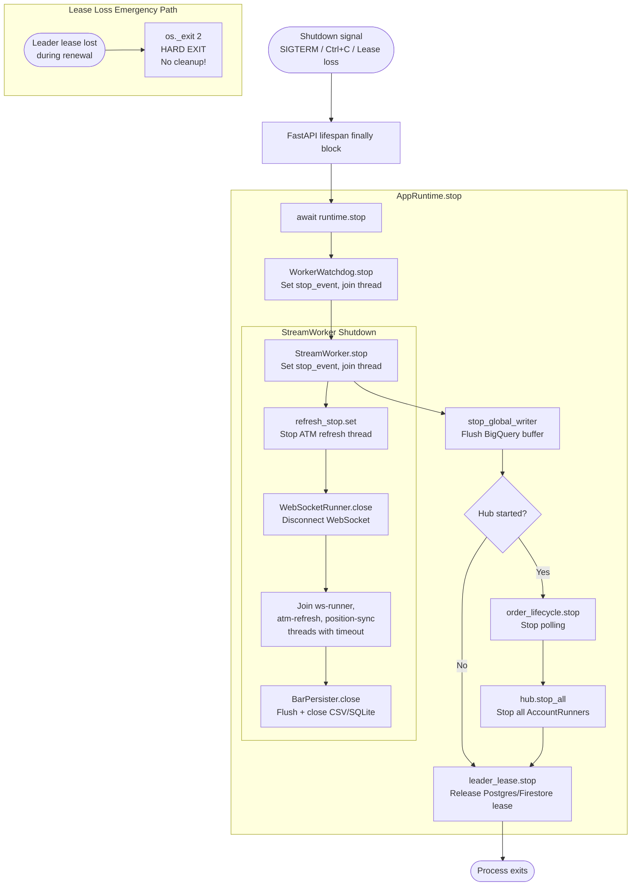

## 12. End-to-End Trade Lifecycle (Complete Path)

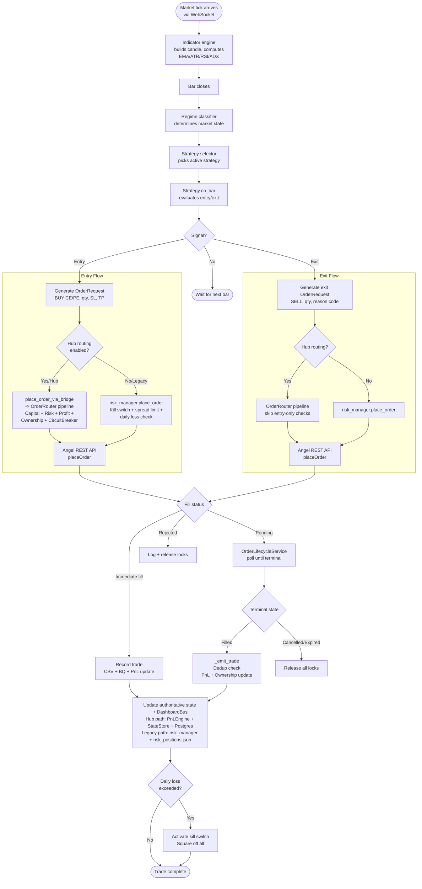

## 13. Data Persistence Architecture

```mermaid
flowchart TD
    subgraph Write Paths
        TRADE([Trade event]) --> CSV_TRADE[TradePersister<br/>trades.csv]
        TRADE --> BQ_TRADE[BQ async writer<br/>BigQuery trades table]
        TRADE --> PG_TRADE[Postgres trade_processed_markers]

        BAR([Indicator bar]) --> CSV_BAR[BarPersister<br/>indicator_bars.csv]
        BAR --> SQLITE_BAR[SQLite indicator DB]
        BAR --> PG_BAR[Postgres indicator_bars]
        BAR --> BQ_BAR[BigQuery indicator table]

        RISK_STATE([Risk state]) --> JSON_FILE[risk_positions.json<br/>Kill switch, positions,<br/>realized PnL]

        PNL([PnL snapshots]) --> FIRESTORE[Firestore<br/>pnl_snapshots collection]
        PNL --> PG_PNL[Postgres pnl_snapshots]

        SWEEP([Sweep state]) --> FS_SWEEP[Firestore sweep_states]
        SWEEP --> PG_SWEEP[Postgres sweep_states]

        ORDER([Order outbox]) --> PG_OUTBOX[Postgres order_submission_outbox]
        ORDER --> MEM_OUTBOX[In-memory fallback<br/>dev/non-LIVE only]

        OWNERSHIP([Position ownership]) --> PG_OWN[Postgres position_ownership]
        OWNERSHIP --> MEM_OWN[In-memory fallback<br/>dev/non-LIVE only]

        AUDIT([Audit events]) --> JSONL[Local JSONL files]
    end

    subgraph Read Paths on Restart
        JSON_FILE --> RESTORE_RISK[Restore kill switch,<br/>open positions, PnL]
        CSV_BAR --> SEED_ENGINE[Seed indicator engine<br/>with historical bars]
        PG_BAR --> SEED_ENGINE
        PG_OUTBOX --> REPLAY_PENDING[Replay PENDING orders]
        FIRESTORE --> RESTORE_PNL[Restore PnL snapshots]
    end
```

## 14. Thread / Process Architecture

```
Process: python -m app.main
├── Main Thread (uvicorn event loop)
│   ├── FastAPI HTTP handlers
│   ├── WebSocket /ws/dashboard
│   ├── Hub asyncio tasks (if multi-hub enabled)
│   │   ├── AccountRunner tasks (one per broker account)
│   │   ├── Subscription watchdog task
│   │   ├── Profit watchdog task
│   │   └── OrderLifecycleService polling task
│   └── Leader lease renewal task
│
├── Thread: stream-worker
│   └── stream_multi_instruments()
│       ├── Thread: ws-runner (WebSocket client)
│       ├── Thread: atm-refresh (ATM strike refresh)
│       ├── Thread: position-sync (Broker reconciliation)
│       └── Thread: stream-event-queue (LatestPerKeyDispatcher)
│           └── Strategy on_bar/on_tick callbacks
│
├── Thread: stream-watchdog
│   └── Monitor stream-worker, restart with backoff
│
├── Thread: bq-async-writer
│   └── Batch flush BigQuery inserts
│
└── Thread: leader-lease-renew (if enabled)
    └── Postgres or Firestore transactional lease renewal
        └── os._exit(2) on lease loss
```
